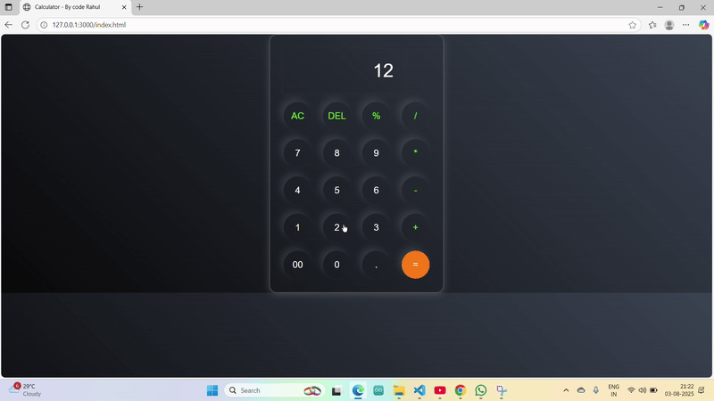

## Calculator-web-app
This is a simple and stylish calculator web project built using HTML, CSS, and JavaScript. It supports basic mathematical operations such as addition, subtraction, multiplication, division, and percentage, along with features like Clear (AC), Delete (DEL), and double zero (00). 

## Demo


## Features

- Basic arithmetic operations: addition, subtraction, multiplication, division, percentage
- Clear (AC) and Delete (DEL) functions
- Responsive and modern UI
- Keyboard and mouse support

## How to Use

1. **Clone or Download** this repository.
2. Open `index.html` in your browser.
3. Click the buttons to perform calculations.

## Project Structure

```
project of calculator/
│
├── index.html      # Main HTML file
├── style.css       # Stylesheet for calculator UI
└── script.js       # JavaScript for calculator logic
```

## Credits

Created by Rahul.
